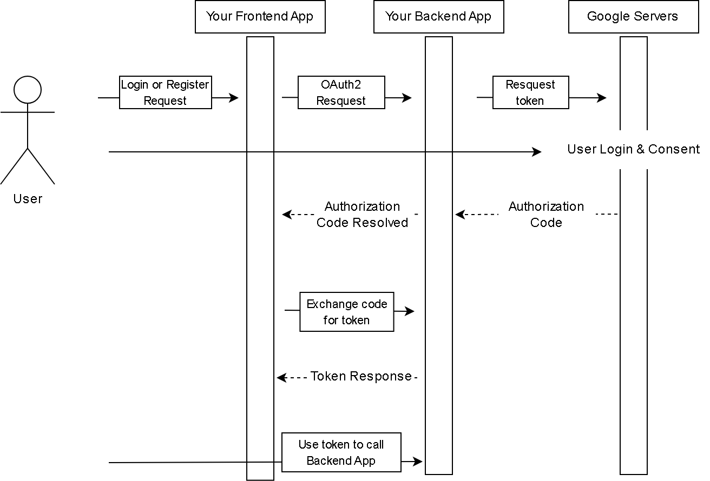

# Multiple Auth API

[![javadoc badge]][javadoc]
[![release badge]][release]
[![codecov badge]][codecov]
[![license badge]][license]

[javadoc]: https://rogelioolarte.github.io/multiple-auth-api/
[javadoc badge]: https://img.shields.io/github/v/release/rogelioolarte/multiple-auth-api?label=javadoc&labelColor=grey&color=brightgreen
[release]: https://github.com/rogelioolarte/multiple-auth-api/releases
[release badge]: https://img.shields.io/github/v/release/rogelioolarte/multiple-auth-api?color=brightgreen&sort=semver
[codecov]: https://codecov.io/gh/rogelioolarte/multiple-auth-api
[codecov badge]: https://codecov.io/gh/rogelioolarte/multiple-auth-api/branch/main/graph/badge.svg
[license]: LICENSE
[license badge]: https://img.shields.io/github/license/rogelioolarte/multiple-auth-api?color=blue

- [Multiple Auth API](#multiple-auth-api)
  - [What is Multiple Auth API?](#what-is-multiple-auth-api)
  - [Introduction to the project](#introduction-to-the-project)
  - [Dependencies](#dependencies)
  - [How it works the process of login with OAuth2?](#how-it-works-the-process-of-login-with-oauth2)
- [Before to start to run the applications](#before-to-start-to-run-the-applications)
- [1. **Start up the database and environment variables:**](#1-start-up-the-database-and-environment-variables)
- [2. **Start up the multiple-auth-api (Backend):**](#2-start-up-the-multiple-auth-api-backend)
- [3. **Start up the multiple-auth-ui (Frontend):**](#3-start-up-the-multiple-auth-ui-frontend)
- [Are you curious about the Development Process?](#are-you-curious-about-the-development-process)
- [Are you curious about OAuth2 Process?](#are-you-curious-about-oauth2-process)

## What is Multiple Auth API?
Spring Boot Application that focuses on implementing multiple authentication methods using OAuhth2 and JWT.

## Introduction to the project
The repository contains a Springboot application for users to **login and register** using email and password or using OAuth2 (Google).
The backend app is meant to be run together with the frontend Angular application.

## Dependencies 
  * Backend:
    *  Java 21
    * Spring Boot 3.4
    * PostgreSQL
    * [JJWT 0.12.6](https://github.com/jwtk/jjwt)
    * [Mapstruct 1.6.3](https://github.com/mapstruct/mapstruct)
  * Frontend:
    * Angular 18
    * [JWT-Decode](https://github.com/auth0/jwt-decode)

## How it works the process of login with OAuth2? 
<details>
  <ul>
    <li>First, The user visits our Frontend application and logs in with "Google" and is redirected to our Backend application where he is then redirected to the Google consent page with our OAuth2 API information for Google</li>
    <li>Second, If he accepts the consent, he is redirected to our Backend application with the authorization code, where it is resolved, where he will first be redirected to our Backend application, but at the end to our Frontend application.</li>
    <li>Third, The received authorization code is processed and resolved in our Backend application, then the received authorization code is exchanged for a Token.</li>
    <li>Fourth, The Token response is received by our Backend application and converted to a Token response with our JWT configuration, then he is redirected to our Frontend application with the new Token.</li>
    <li>Fifth, The user can access our Backend application to use any of our services.</li>
  </ul>
</details>
<div align="center" >
  
</div>

[Base Image Source](https://developers.google.com/static/identity/protocols/oauth2/images/flows/authorization-code.png)

# Before to start to run the applications
 - **Note: Use a terminal with bash to run the scripts.**

# 1. **Start up the database and environment variables:**
 1. Run the following script to create the security variables:
 
```console
bash generate_keys.sh
```

 2. Create your credentials for using oauth2 in the google cloud console or follow the steps detailed [here](https://blog.devgenius.io/part-3-implementing-authentication-with-spring-boot-security-6-oauth2-and-angular-17-via-8716646ed062).

  3. Run Postgresql docker container with the following command (replace _{PASSWORD}_ with your own password):

```console
docker run --name multiple-auth-app-postgres -e POSTGRES_PASSWORD={PASSWORD} -d -p 127.0.0.1:5432:5432 postgres
```

 - Don't change the port configuration when running in a local environment. The syntax of the mapping is for extra security, so that the database is not accessible from outside the container.

 - If you change the password to the postgresql database, make sure to update the password in the application.properties file of the **_multiple-auth-api_** project.
 - If you need to connect to the postgresql database container, run the following command:

```console
docker exec -it multiple-auth-app-postgres bash
```

 - Connect to postgresql database, once inside the container:
```console
psql -U postgres
```

# 2. **Start up the multiple-auth-api (Backend):**
  - Note: Currently, [dotenv-java](https://github.com/cdimascio/dotenv-java) is used to load environment variables. Please note that this library should not be used in a production environment.
  
  1. Make sure to create a _.env_ file in the root of the project, and list all the required properties there as key-value pairs (don't forget to exclude this file from version control):

```
 SPRING_DATASOURCE_USERNAME=postgres
 SPRING_DATASOURCE_PASSWORD=K29r8Dhc79n2gPG86CRhoVt9NBxTa0Gk
 ......
```

 2. Run the following command from the root directory of the project or just press the start button in your IDE:

```console
./mvnw spring-boot:run
```

  - Default port for the _multiple-auth-api_ is 8080. If you want to change the port, set the "server.port" property in the _application.properties_ file. If you change the port, make sure to update the port in the multiple-auth-ui project as well (_constants.ts_ file, "API_BASE_URL" parameter).
  
 - As this project uses OAuth2, make sure to update the redirect-uri in the _application.properties_ file and in configurations at OAuth2 providers (Google, GitHub, Twitter, etc.) too.
  
 - If you checked out from _main_ branch, you will see that _application.properties_ contains references to environment variables.

# 3. **Start up the multiple-auth-ui (Frontend):**
  1. Run the following command from the root directory of the project:

```console
npm install
```
  2. Run the following command from the root directory of the project:

```console
npm run start
```

  - Default port for the multiple-auth-ui is 4200. If you want to change the port, update the port in the angular.json file. On the following path: _multiple-auth-ui -> architect -> serve_ add this:
  
```
"options": {
  "port": [desired-port]
}
```

  - Make sure to update authorized redirect uri usage places in the _multiple-auth-api_ too.

# Are you curious about the Development Process? 
The Use of OAuth2 has been implemented according to the following repository, if you find this project useful, please visit the following repository and follow the step-by-step creation project:
You can find the corresponding repository [here](https://github.com/anitalakhadze/multiple-auth-ui).

# Are you curious about OAuth2 Process?
Visit the documentation and explanation of Google OAuth2 [here](https://developers.google.com/identity/protocols/oauth2).
