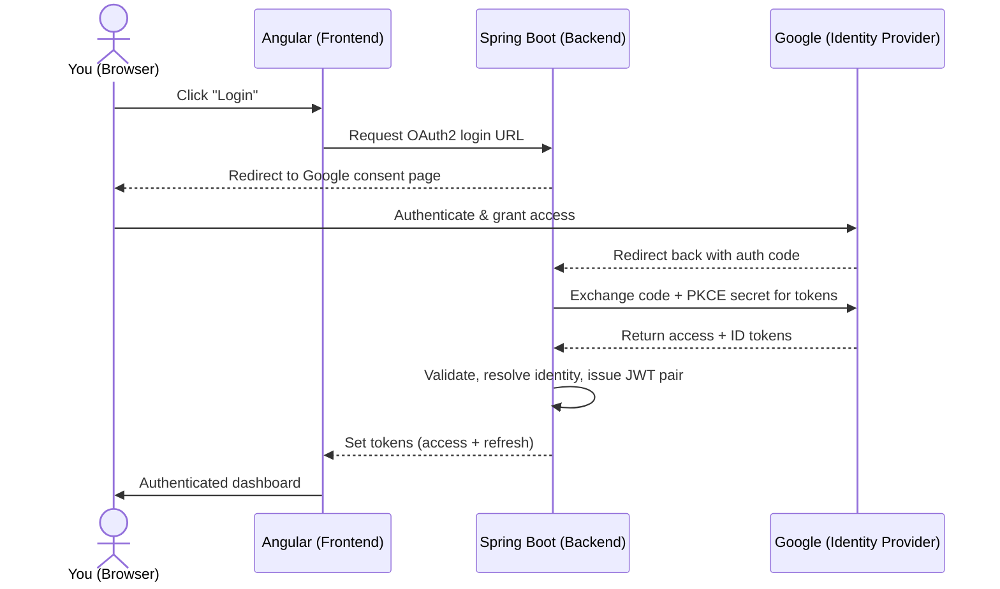

# AUTH ALPACA

[](https://rogelioolarte.github.io/auth-alpaca/)
[](https://github.com/rogelioolarte/auth-alpaca/releases)
[](https://codecov.io/gh/rogelioolarte/auth-alpaca)
[](LICENSE)

<div align="center">
  
</div>

**Auth Alpaca** is a production-ready reference implementation for OAuth2 and JWT-based authentication built with **Spring Boot 4 + Java 25** and **Angular 21 + Bun**. It implements the Authorization Code flow with PKCE, asymmetric RS512 signing, refresh token rotation with automatic breach detection, and rate-limited token endpoints — all containerized with Docker Compose.

The frontend is a functional integration example; the backend is the core — hardened, tested, and ready for real-world adoption.

---

## 🧭 Navigation

| Category | Document | Description |
|---|---|---|
| **🏗️ Architecture** | [Backend Architecture](docs/backend-architecture.md) | Spring Security, JWT, API, database schema |
| | [Frontend Architecture](docs/frontend-architecture.md) | Angular guards, interceptors, token lifecycle |
| **🧪 Quality** | [Testing Strategy](docs/testing-strategy.md) | Unit tests, Testcontainers, k6 performance |
| | [Deployment & Operations](docs/deployment.md) | Docker Compose topology, env vars, networking |
| **🎓 Learning** | [Start the 4-Pillar Journey](docs/learning/index.md) | Masterclass from theory to code |
| | [📖 Glossary](docs/learning/glossary.md) | Security terminology reference |

---

## 🚀 Quick Deploy (Docker)

You need **Docker**, **Docker Compose**, and a **bash terminal**. That's it.

```bash
# 1. Clone
git clone https://github.com/rogelioolarte/auth-alpaca.git
cd auth-alpaca

# 2. Generate JWT RSA key pairs
./generate_keys.sh -L secrets/

# 3. Configure environment
cp .env.example .env
```

Edit `.env` and set your **Google OAuth2 credentials** (`GOOGLE_CLIENT_ID`, `GOOGLE_CLIENT_SECRET`) and a secure database password (`SPRING_DATASOURCE_PASSWORD`). The rest of the defaults work out of the box.

```bash
# 4. Launch everything
docker compose up -d --build
```

Once the stack is up:
- **Frontend**: `http://localhost:80`
- **Backend API**: `http://localhost:8080`
- **Health check**: `GET http://localhost:8080/api/auth`

> Log in with `admin@admin.com` / `123456789` or click "Login with Google" if you configured OAuth2 credentials.

---

## 🛠️ Local Development (Without Docker)

You can run the backend directly via Maven for faster iteration:

### Prerequisites
- **Java 25** (with preview features enabled)
- **PostgreSQL 18** running locally on port 5432
- **Bun 1.3.11** (for the frontend)

### Backend

```bash
# From project root:
./backend/mvnw clean compile -Punit-tests   # compile + run unit tests

# Run integration tests (requires Docker for Testcontainers):
./backend/mvnw clean verify -Pintegration-tests

# Start the application:
cd backend && ./mvnw spring-boot:run
```

The backend starts on `http://localhost:8080` by default. See [Testing Strategy](docs/testing-strategy.md) for the full test suite documentation.

### Frontend

```bash
cd frontend && bun install && bun run start
```

The frontend dev server runs on `http://localhost:4200`.

> The default `application.properties` uses `postgres-db:5432` as the DB host (Docker Compose DNS). For local development, override with your own `SPRING_DATASOURCE_URL` — for example by copying `backend/.env.example` to `backend/.env` and setting `SPRING_DATASOURCE_URL=jdbc:postgresql://localhost:5432/auth-alpaca`.

---

## 🔐 Authentication Flow (OAuth2 + PKCE)

Auth Alpaca implements the **Authorization Code flow with PKCE** — the industry standard for secure public-client authentication. Here is the high-level handshake:


```mermaid
sequenceDiagram
    actor You as You (Browser)
    participant UI as Angular (Frontend)
    participant API as Spring Boot (Backend)
    participant Google as Google (Identity Provider)

    You->>UI: Click "Login"
    UI->>API: Request OAuth2 login URL
    API-->>You: Redirect to Google consent page
    You->>Google: Authenticate & grant access
    Google-->>API: Redirect back with auth code
    API->>Google: Exchange code + PKCE secret for tokens
    Google-->>API: Return access + ID tokens
    API->>API: Validate, resolve identity, issue JWT pair
    API-->>UI: Set tokens (access + refresh)
    UI->>You: Authenticated dashboard
```

The backend signs access tokens (5 min) and refresh tokens (12 h) with **separate RS512 key pairs**. Refresh tokens rotate on every use — if an old token is replayed, the entire family is revoked immediately.

---

## 🛠️ Stack

| Layer | Technology | Key Libraries |
|---|---|---|
| **Backend** | Java 25 | Spring Boot 4.0.6, Spring Security 6, Spring Data JPA, JJWT, Flyway |
| **Frontend** | Angular 21 | RxJS, JWT-Decode, ngx-cookie-service |
| **Database** | PostgreSQL 18 | Dockerized, Flyway-migrated |
| **Infra** | Docker Compose | Multi-stage builds, isolated networks |

---

<sub>Auth Alpaca — Built with Spring Boot 4 + Java 25 + Angular 21</sub>
