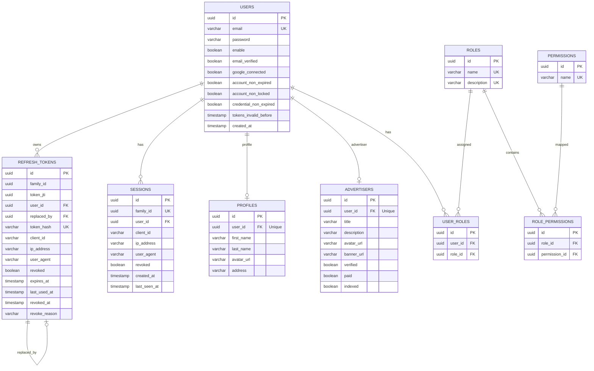

# Backend Architecture

> 🏠 [README](../README.md) — **Backend Architecture**

## 📑 On This Page
- [🛠️ Java 25 & Spring Boot Runtime Configuration](#-java-25--spring-boot-runtime-configuration)
- [🔒 Spring Security 6 Integration](#-spring-security-6-integration)
- [🔑 JWT Token Generation & Rotation](#-jwt-token-generation--rotation)
- [🗄️ Database Schema & Flyway Migrations](#-database-schema--flyway-migrations)
- [🔌 Core API Endpoints](#-core-api-endpoints)

---

This document provides a highly technical overview of the `auth-alpaca` backend API, designed for developers and system architects. The system is built on **Spring Boot 4.0.6** using **Java 25** (with preview features enabled) as the runtime.

---

## 🛠️ Java 25 & Spring Boot Runtime Configuration

The application is compiled and executed under Java 25. Preview features are enabled to leverage cutting-edge language capabilities.

### Maven Compiler Configuration (`pom.xml`)
The `maven-compiler-plugin` is configured to enable JVM preview features at compile-time:

```xml
<properties>
    <java.version>25</java.version>
    <maven.compiler.args>--enable-preview</maven.compiler.args>
</properties>

<build>
    <plugins>
        <plugin>
            <groupId>org.apache.maven.plugins</groupId>
            <artifactId>maven-compiler-plugin</artifactId>
            <configuration>
                <compilerArgs>
                    <arg>--enable-preview</arg>
                </compilerArgs>
            </configuration>
        </plugin>
    </plugins>
</build>
```

### Surefire Test Execution Arguments
JVM flags are injected during test runs to allow mocks and dynamic agents on Java 25:
```xml
<plugin>
    <groupId>org.apache.maven.plugins</groupId>
    <artifactId>maven-surefire-plugin</artifactId>
    <configuration>
        <argLine>
            -javaagent:${settings.localRepository}/org/mockito/mockito-core/${mockito.version}/mockito-core-${mockito.version}.jar
            -Xshare:off 
            -XX:+EnableDynamicAgentLoading
            --sun-misc-unsafe-memory-access=allow
        </argLine>
    </configuration>
</plugin>
```

---

## 🔒 Spring Security 6 Integration

Authentication and authorization are managed by Spring Security 6, configured for stateless, token-based execution.

### Security Pipeline Architecture
The security configuration disables CSRF and Form Login, forces stateless sessions, and mandates token validation on all endpoints except white-listed paths.

Key patterns in `SecurityConfig.java`:
- **Stateless Session**: `SessionCreationPolicy.STATELESS` ensures no server-side HTTP session storage.
- **Access Rule Mapping**:
  - `/api/auth/**` and `/oauth2/**` are public (`permitAll()`).
  - `/api/advertisers/**` — read-only endpoints (`GET`) are public; write endpoints (`POST`, `PUT`, `DELETE`) are secured via `@PreAuthorize` at the controller level.
  - `/api/sessions/**`, `/api/profiles/**`, and `/api/users/**` require authentication.
  - `/api/roles/**` and `/api/permissions/**` require the `ADMIN` role.
  - All other routes are denied by default.
- **Custom Token Validation**: A custom `JwtTokenValidatorFilter` is registered before `BasicAuthenticationFilter` to validate incoming access tokens and establish the authentication context.
- **Custom Client Registration**: Utilizes `ClientRegistrationRepository` and a customized `OAuth2AccessTokenResponseClient` (based on `RestClientAuthorizationCodeTokenResponseClient` and a custom message converter) to fetch access tokens from external identity providers.

---

## 🔑 JWT Token Generation & Rotation

The backend uses **JJWT (Java JWT)** for token operations. It utilizes an asymmetric cryptographic architecture: RSA keys signed with **RS512** (RSA with SHA-512).

### Key Architecture
The access token and refresh token use **separate RSA key pairs** to limit exposure:
1. **Access Key Pair**: Used to sign and verify ephemeral access tokens (default expiration: 5 minutes).
2. **Refresh Key Pair**: Used to sign and verify long-lived refresh tokens (default expiration: 12 hours).

### Token Structure and Claims
* **Access Token Claims**:
  - `iss`: Issuer (`auth-alpaca.com`)
  - `sub`: Username / Subject
  - `userId`: Internal database identifier of the user
  - `profileId`: Reference to user profile (if exists)
  - `advertiserId`: Reference to advertiser details (if exists)
  - `authorities`: Comma-delimited list of roles and permissions
  - `iat` / `nbf` / `exp`: Temporal validation fields
* **Refresh Token Claims**:
  - `iss`: Issuer
  - `sub` / `userId`: User database ID
  - `jti`: JSON Web Token Unique ID (UUID format)
  - `familyId`: Rotation family identifier (UUID format)
  - `clientId`: Client device session tracker (UUID v7 format)
  - `iat` / `nbf` / `exp`: Temporal validation fields

### Refresh Token Rotation (RTR) & Security
To prevent unauthorized access through stolen tokens, the system implements **Refresh Token Rotation (RTR)**:
1. When a client requests a token rotation (`POST /api/auth/rotate`), the server validates the incoming token and extracts the `jti` and `familyId`.
2. The database stores a SHA-256 hash of each refresh token's `jti` claim (`token_hash`) for lookup and verification. Raw tokens are never stored.
3. **Breach Detection**: When a token is rotated, its hash is deleted and a new one is inserted. If a client attempts to reuse an older, already-rotated token, the lookup fails to find a matching active hash — but the `familyId` still exists in the `sessions` table. This mismatch triggers:
   - Immediate invalidation of the entire token family.
   - Revocation of all active tokens under the same `familyId`.
   - Forced logout, mitigating replay attacks.

---

## 🗄️ Database Schema & Flyway Migrations

Database migration is automated using Flyway. The system defines a PostgreSQL schema divided into 2 default migrations:

### Migration Versions
1. **`V1__init_schema.sql`**: Bootstraps the core relational tables.
2. **`V2__seed_security_data.sql`**: Seeds default Roles, Permissions, and Admin credentials.

### Database Tables (Relational Map)



---

## 🔌 Core API Endpoints

All authenticated requests must include the header: `Authorization: Bearer <accessToken>`. Token rotation requests additionally require the `X-Refresh-Token` header containing the current refresh token (see `/api/auth/rotate` below).

| Method | Endpoint | Auth | Request Headers / Body | Description |
| :--- | :--- | :--- | :--- | :--- |
| **POST** | `/api/auth/register` | Public | **Body**: `{ "email", "password" }`<br>**Headers**: `X-Client-Id`, `User-Agent` | Registers a new user account with credentials. |
| **POST** | `/api/auth/login` | Public | **Body**: `{ "email", "password" }`<br>**Headers**: `X-Client-Id`, `User-Agent` | Authenticates using email/password. Returns access & refresh tokens. |
| **POST** | `/api/auth/logout` | Authenticated | **Headers**: `X-Refresh-Token`, `X-Client-Id` | Logs out user and revokes the active refresh token. |
| **POST** | `/api/auth/exchange` | Public | **Body**: `{ "code", "code_verifier", "redirect_uri", "client_id" }` | Exchanges a code from Google OAuth2 with PKCE verification. |
| **POST** | `/api/auth/rotate` | Authenticated | **Headers**: `X-Refresh-Token`, `X-Client-Id`, `User-Agent` | Rotates the refresh token. Rate limited per IP address. |
| **GET** | `/api/auth/me` | Authenticated | — | Returns User Principal details for the current session. |
| **GET** | `/api/auth` | Public | — | Health check API. Returns "API Online". |

---

🏠 [Back to README](../README.md) | 📚 [Full Documentation](../README.md#-navigation-hub-docs-as-code)

#### Related Docs
- [Frontend Architecture](frontend-architecture.md) — Angular 21 SPA, authentication integration, and routing guards
- [Testing Strategy](testing-strategy.md) — Unit, integration, and performance testing setup
- [Deployment](deployment.md) — Docker Compose topology and environment configuration
