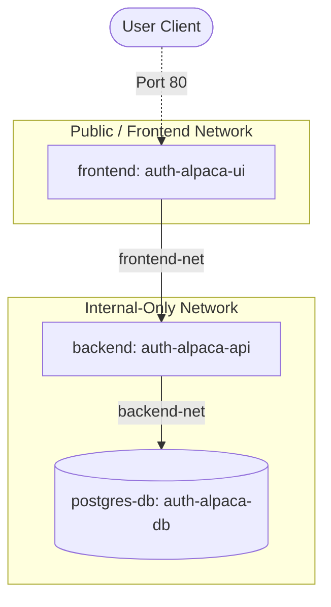

# Deployment & Operations

> [README](../README.md) — **Deployment & Operations**

---

This document details the Docker-based multi-service topology, network security mapping, and system environment variables configuration for the `auth-alpaca` stack.

---

## Docker Compose Topology

The production-ready stack is orchestrated using `docker-compose.yml`, which separates services logically into layers.



### Services Overview
1. **`postgres-db` (auth-alpaca-db)**:
   - Run from image `postgres:18-alpine`.
   - Health check utilizes `pg_isready` to ensure database readiness before booting the backend.
   - Volumes map `postgres_data` to `/var/lib/postgresql` for persistent storage.
   - Restricted to the `backend-net` internal network.
2. **`backend` (auth-alpaca-api)**:
   - Custom build using `./backend/Dockerfile`.
   - Configured with `restart: unless-stopped` and resources limits capped to 2 CPUs and 2GB RAM.
   - Key storage secrets directory `./secrets` is mounted read-only (`ro`) to `/keys`.
   - Enters both `backend-net` (to talk to db) and `frontend-net` (to receive calls).
3. **`frontend` (auth-alpaca-ui)**:
   - Custom build using `./frontend/Dockerfile`.
   - Maps container port `8080` (running Nginx) to host port `80`.
   - Connected strictly to `frontend-net`.

---

## Service Networks Configuration

To enforce a zero-trust network topology, database and backend traffic are isolated.

```yaml
networks:
  backend-net:
    internal: true
  frontend-net:
```

### Network Descriptions
* **`backend-net` (`internal: true`)**:
   - Hosts the database (`postgres-db`) and the Spring Boot API (`backend`).
  - The `internal: true` flag guarantees that no container in this network can communicate with the outside world, nor can external entities access them directly. This prevents PostgreSQL port scanning.
* **`frontend-net`**:
  - Connects the Nginx-hosted client (`frontend`) and the Spring Boot API (`backend`).
  - Enables reverse proxying and API request resolution from the client browser.

---

## Environment Variables Reference

The following table summarizes all environment variables required to run the services, loaded from the `.env` file at the project root.

| Environment Variable | Service | Description | Example / Default Value |
| :--- | :--- | :--- | :--- |
| `SPRING_DATASOURCE_URL` | `backend` | JDBC connection URL targeting the postgres-db service. | `jdbc:postgresql://postgres-db:5432/auth-alpaca` |
| `SPRING_DATASOURCE_USERNAME` | `postgres-db`, `backend` | Database user account name. | `postgres` |
| `SPRING_DATASOURCE_PASSWORD` | `db`, `backend` | Secure password for PostgreSQL authentication. | `your_db_password` |
| `SPRING_DATASOURCE_MAXIMUM_POOL_SIZE` | `backend` | Maximum size of the Hikari connection pool. | `50` |
| `SPRING_DATASOURCE_MINIMUM_IDLE` | `backend` | Minimum number of idle connections kept by Hikari. | `10` |
| `JWT_ISSUER` | `backend` | Issuer identifier claim inserted into tokens (`iss`). | `auth-alpaca.com` |
| `JWT_ACCESS_TOKEN_EXPIRATION` | `backend` | Access token duration in milliseconds (5 min). | `300000` |
| `JWT_REFRESH_TOKEN_EXPIRATION` | `backend` | Refresh token duration in milliseconds (12 hours). | `43200000` |
| `JWT_ACCESS_PRIVATE_KEY_PATH` | `backend` | File path mapping the EC P-256 private key for Access tokens. | `file:/keys/access_private.pem` |
| `JWT_ACCESS_PUBLIC_KEY_PATH` | `backend` | File path mapping the EC P-256 public key for Access tokens. | `file:/keys/access_public.pem` |
| `JWT_REFRESH_PRIVATE_KEY_PATH` | `backend` | File path mapping the EC P-256 private key for Refresh tokens. | `file:/keys/refresh_private.pem` |
| `JWT_REFRESH_PUBLIC_KEY_PATH` | `backend` | File path mapping the EC P-256 public key for Refresh tokens. | `file:/keys/refresh_public.pem` |
| `APP_OAUTH2_REDIRECT_URI` | `backend` | Callback landing URI registered with Google IDP. | `http://localhost:80/oauth2/redirect` |
| `APP_FRONTEND_URI` | `backend` | Target frontend path to redirect after successful login. | `http://localhost:80/login` |
| `GOOGLE_CLIENT_ID` | `backend` | Google Cloud Console OAuth2 Client Identifier. | `your_google_client_id` |
| `GOOGLE_CLIENT_SECRET` | `backend` | Google Cloud Console OAuth2 Secret Key. | `your_google_client_secret` |
| `MAX_SESSIONS_PER_USER` | `backend` | Maximum concurrent active sessions allowed per user. | `5` |
| `INFINITY_LOGIN` | `backend` | Disables absolute token lifetimes if set to true. | `false` |
| `BCRYPT_COST_FACTOR` | `backend` | Work factor (strength) for the BCrypt encoder. | `12` |
| `ADMIN_EMAIL` | `backend` | Bootstrap administrator email account. | `admin@admin.com` |
| `ADMIN_PASSWORD` | `backend` | Bootstrap administrator password. | `123456789` |
| `API_BASE_URL` | `frontend` | Absolute base HTTP URL target of the API server. | `http://localhost:8080` |
| `RATELIMIT_MAX_RPM` | `backend` | Max requests per minute threshold allowed per client IP. | `500` |

---

[Back to README](../README.md) | [Full Documentation](../README.md#navigation-hub-docs-as-code)

#### Related Docs
- [Backend Architecture](backend-architecture.md) — Spring Boot API, JWT token system, and database schema
- [Testing Strategy](testing-strategy.md) — Unit, integration, and performance testing setup
- [Frontend Architecture](frontend-architecture.md) — Angular 21 SPA, authentication integration, and routing guards
