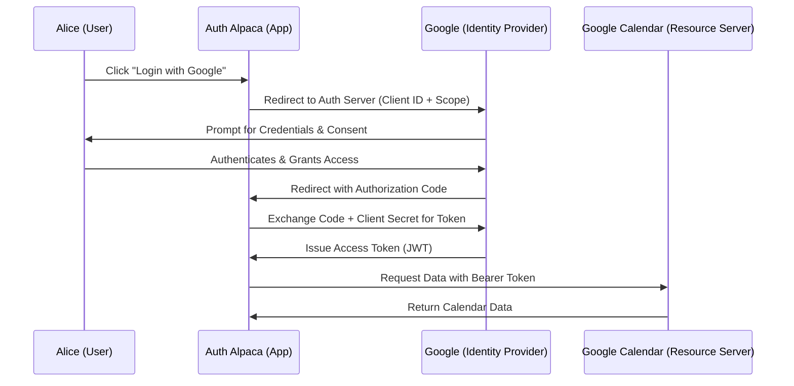

# 🔄 The OAuth2 Narrative: The Dance of Delegation

Most people think OAuth2 is about "logging in". It isn't. OAuth2 is about **Delegation**.

### The Story: Alice, the App, and Google

Imagine **Alice**. Alice uses a great app called **Auth Alpaca**. She wants Auth Alpaca to be able to see her Google Calendar to schedule her meetings, but she doesn't want to give Auth Alpaca her Google password. (Giving your password to a third party is a security nightmare).

This is where the **Authorization Code Flow** comes in. Think of it as a carefully choreographed dance:

1. **The Request**: Alice clicks "Connect Google Calendar". Auth Alpaca redirects her to Google's login page. Along with her, it sends a `client_id` (who is asking?) and a `scope` (what exactly do they want to access?).
2. **The Consent**: Google authenticates Alice. Google then asks her: *"Do you allow Auth Alpaca to read your calendar?"*
3. **The Secret Handshake (The Code)**: Alice says "Yes". Google redirects her back to Auth Alpaca, but it doesn't give the app the token yet. Instead, it gives her a short-lived **Authorization Code**.
4. **The Exchange**: Auth Alpaca takes that code and sends it back to Google via a secure, server-to-server channel, along with a `client_secret` (a password only the app and Google know).
5. **The Prize (The Token)**: Google verifies the code and the secret. If everything matches, it issues an **Access Token**.

Now, whenever Auth Alpaca wants to see the calendar, it just shows that token to the Google API.

### The Flow Visualized

### Why this complexity?
You might ask: *"Why not just send the token in step 3?"* 

Because step 3 happens in the **browser URL**. Browser history, logs, and malicious browser extensions can see the URL. By sending a "code" first and exchanging it on the **backend** (step 4), the actual Access Token never touches the browser's address bar, keeping it safe from "URL sniffing".

> **Think Deeper**: If the `client_secret` were leaked to the public, how would that break the security of the Authorization Code flow? Could an attacker impersonate Auth Alpaca?
