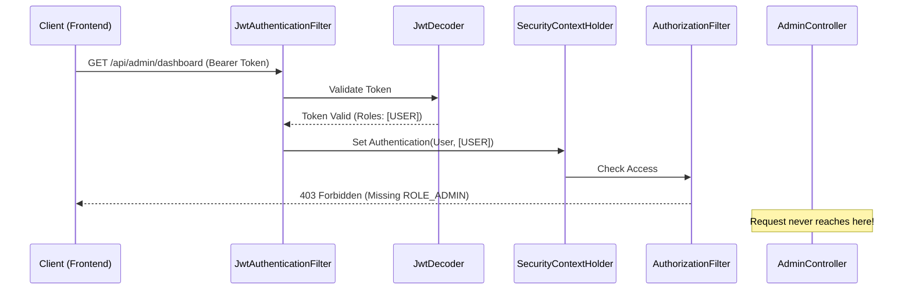

# 🚀 The Request Odyssey: Backend Flow

When a request hits the Auth Alpaca backend, it doesn't go straight to the Controller. It must survive a gauntlet of security checks known as the **Spring Security Filter Chain**.

## The Odyssey Path

Trace the journey of a single request to `/api/admin/dashboard`:

1. **The Entry**: The request hits the `DelegatingFilterProxy`, which hands it over to the Spring Security `FilterChainProxy`.
2. **The Extraction**: The `JwtAuthenticationFilter` intercepts the request. It looks for the `Authorization` header and extracts the Bearer token.
3. **The Validation**: The filter passes the token to the `JwtDecoder`. The decoder uses the **Public Key** to verify the signature and checks the `exp` (expiration) claim.
4. **The Identity**: Once validated, the filter creates an `Authentication` object containing the user's identity (Principal) and their roles (Authorities).
5. **The Context**: This object is placed into the `SecurityContextHolder`. Now, the rest of the application "knows" who is making the request.
6. **The Gatekeeper**: The `AuthorizationFilter` checks the `SecurityContext`. It sees the request is for an `/admin` route and checks if the user has `ROLE_ADMIN`.
7. **The Destination**: Only if all previous steps succeed does the request finally reach the `@RestController` method.

### Sequence Diagram

## The "Fail-Fast" Principle
Notice that the most "expensive" operations (like hitting the Controller and querying the database) happen last. We fail as early as possible. If the token is malformed, we stop at the `Decoder`. If the user isn't an admin, we stop at the `AuthorizationFilter`.

> **Think Deeper**: If we wanted to implement a "Blacklist" (to revoke specific JWTs before they expire), at which point in the Odyssey should that check happen? In the `JwtDecoder` or in a separate filter? Why?
