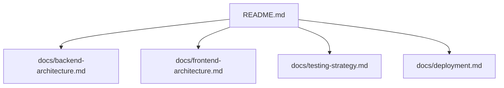
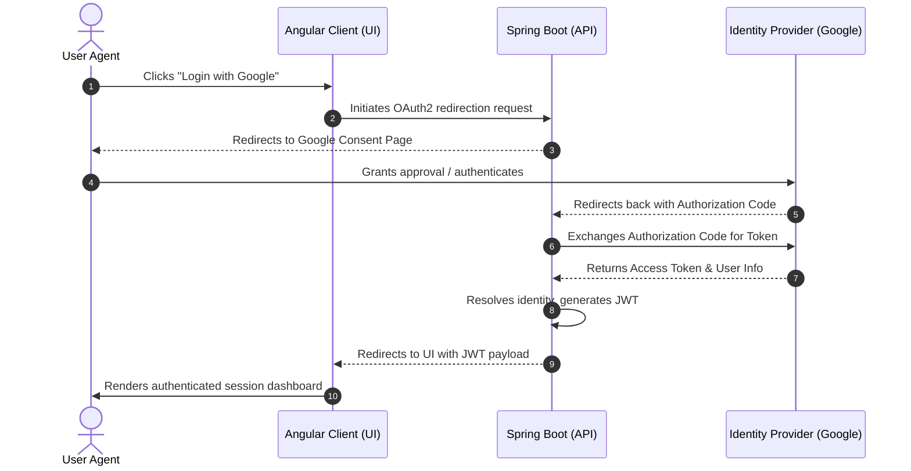

# 🦙 Auth Alpaca

> A secure, production-ready reference architecture for OAuth2 and JWT-based authentication using **Spring Boot 4.0.6** with **Java 25** and **Angular 21** managed by **Bun**.

---

[](https://rogelioolarte.github.io/auth-alpaca/)
[](https://github.com/rogelioolarte/auth-alpaca/releases)
[](https://codecov.io/gh/rogelioolarte/auth-alpaca)
[](LICENSE)

---

## 🧭 Navigation Hub (Docs-as-Code)

This repository follows a modular documentation structure. Use the links below to explore specific domains:



*   **[Backend Architecture](/docs/backend-architecture.md)**
    *   Spring Security 6 & OAuth2 integration patterns.
    *   JWT token generation, validation, and key rotation strategy.
    *   Database schemas, JPA/Hibernate mapping, and REST API specification.
*   **[Frontend Architecture](/docs/frontend-architecture.md)**
    *   Angular 21 application structure, guards, and interceptor patterns.
    *   Session state management and token storage mechanisms.
    *   Integration deployment options and run configurations.
*   **[Testing Strategy](/docs/testing-strategy.md)**
    *   Spring Boot unit and slice tests with `@WebMvcTest` and `@DataJpaTest`.
    *   Integration testing using Testcontainers.
    *   Performance testing suite using Gatling.
*   **[Deployment & Operations](/docs/deployment.md)**
    *   Multi-environment properties and environment variable mappings.
    *   Docker Compose multi-service topology.
    *   Production readiness checklist and security configurations.

---

## 🛠️ Stack Overview

| Layer | Technology | Primary Libraries / Frameworks / Tools |
| :--- | :--- | :--- |
| **Backend** | Java 25 | Spring Boot 4.0.6, Spring Security, Spring Data JPA, JJWT |
| **Frontend** | Angular 21 | RxJS, JWT-Decode, TypeScript, Bun 1.3.11 |
| **Database** | PostgreSQL | Dockerized Postgres |

---

## 🚀 Quick Start Guide

### 1. Security & Environment Setup
Generate the required JWT asymmetric keys using the helper script. Depending on your goal, use the appropriate location:

- **For Backend Execution**:
  ```bash
  ./generate_keys.sh -L backend/src/main/resources/keys
  ```
- **For Backend Tests**:
  ```bash
  ./generate_keys.sh -L backend/src/test/resources/keys
  ```
- **For Docker Deployment**:
  ```bash
  ./generate_keys.sh -L secrets/
  ```

Configure your local environment by copying the template file:
```bash
cp .env.example .env
```
Ensure you update the variables inside `.env` with your Google Cloud Console OAuth2 client credentials and secure passwords.

### 2. Spinning Up Postgres
Launch the PostgreSQL container using Docker:
```bash
docker run --name auth-alpaca-app-postgres \
  -e POSTGRES_USER=postgres \
  -e POSTGRES_PASSWORD=your_secure_password \
  -e POSTGRES_DB=auth-alpaca \
  -d -p 127.0.0.1:5432:5432 postgres
```

---

## 🖥️ Application Run Modes

### Backend Application
Run the Spring Boot application using the wrapper script from the root directory:
```bash
./mvnw spring-boot:run
```
*   **Java Runtime:** Java 25 (configured with `--enable-preview`)
*   **Default API Port:** `8080`

### Frontend Application & Integration Example
To run the web UI and verify the end-to-end integration:

1.  **Install dependencies using Bun:**
    ```bash
    bun install
    ```
2.  **Start development server:**
    ```bash
    bun run start
    ```
3.  **Local Access:** Navigate to `http://localhost:4200` to interact with the application.
4.  **Running the Integration Example:**
    Ensure both backend and frontend are running. Login via the UI using local test credentials or click the **Google OAuth2** button to experience the federated login sequence.

---

## 🔐 OAuth2 Authentication Flow

Auth Alpaca implements the standard OAuth2 Authorization Code flow with PKCE/State validation. The diagram below illustrates how components interact during a typical login handshake:



For a detailed step-by-step breakdown of endpoint operations, see **[docs/backend-architecture.md](/docs/backend-architecture.md)**.
